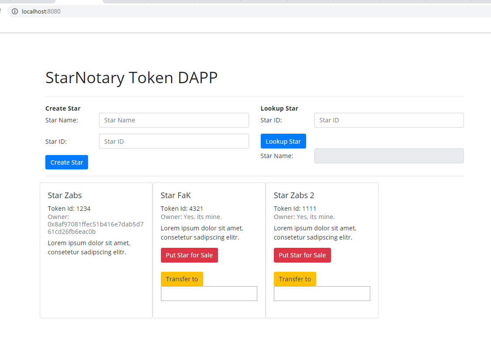

# Project #5. Private Blockchain Ethereum and Token ERC-721

This is a project example to learn how to create a decentralized application on Ethereum, a public Blockchain, using non-fungible tokens (NFTs) ERC 721.

Throught this example, you can connect on Rinkeby network (test net) to create, sell or transfer stars.



# Example 

**ERC-721 Token Name** : "ZabsToken"  
**ERC-721 Token Symbol** : "ZabsT"  
**Token/Smart Contract Address**: [0x09f78710a967b3c949c8c973d349c079df7c3f1b02281c7303dcedd47912e83a](https://rinkeby.etherscan.io/tx/0x09f78710a967b3c949c8c973d349c079df7c3f1b02281c7303dcedd47912e83a)

**Account 1**: [0x3724e36A1b2DAE48F483421B2D5CaE662c51Cfd2](https://rinkeby.etherscan.io/address/0x3724e36A1b2DAE48F483421B2D5CaE662c51Cfd2npm )  
**Account 2**: [0x8af97081ffEC51b416e7daB5d761cD26FB6eAc0b](https://rinkeby.etherscan.io/address/0x8af97081ffEC51b416e7daB5d761cD26FB6eAc0b)

**Create First Star TX**: [0x7e9f15ef7c41f1f04e36cbdcdce9d1ce14bd4d2f250d715847c6a8a1356d65f5](https://rinkeby.etherscan.io/tx/0x7e9f15ef7c41f1f04e36cbdcdce9d1ce14bd4d2f250d715847c6a8a1356d65f5)  
**TX from Account 1 to Account 2**: [0x29a2f66043333811111be839f70b85b1fba06125c6bf162daac4cd8112b8cb08](https://rinkeby.etherscan.io/tx/0x29a2f66043333811111be839f70b85b1fba06125c6bf162daac4cd8112b8cb08)


# Requirements

### 1. Installing Metamask, 
Install Metamask to connect the wallet with the Rinkeby network
https://metamask.io/

### 2. Connecting with the gateway

a. Create a new account on Infura (gateway to connect on newtwork), create a new project and get the "PROJECT ID"
https://infura.io/dashboard
b. Once you have the Metamask installed, get you seed word 
c. Put this informations on the truffle.js (HDWalletProvider)
	Example:

    return new HDWalletProvider("original eoass ehssd ke ntist spike ribbon fish foil sketch cushion", "https://rinkeby.infura.io/v3/f25a7b586bb34c17bc123445e48f57c64") 

d. Save the file.

### 3. Taking Ether

a. Take Ether using Faucet website. This will be necessary to create, transfer, or buy stars on the Rinkeby network
https://faucet.rinkeby.io/
b. Create a new post at google plus, take the URL post and insert into faceut and press the button "Give me Ether"
	Example: https://plus.google.com/104295604359092032887/posts/1234


# Starting the project

Once installed, go into your cloned directory, and run:  
```npm install```

For starting the development console, run:  
```truffle develop```

For compiling the contract, inside the development console, run:  
```compile```

For running unit tests the contract, inside the development console, run:  
```test```

For migrating the contract to the locally running ethereum network, inside the development console, run:  
```migrate --reset```


For deploy at the Rinkeby network, use the following command:
```truffle deploy --network rinkeby ```

For running the Front End of the DAPP, open another terminal window and go inside the project directory, and run:  
```npm run dev```

Open the DAPP in Browser [http://localhost:8080/]()